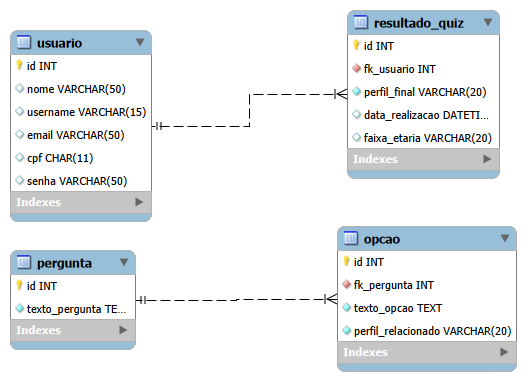

# Oasis Forever

O **Oasis Forever** é uma aplicação web desenvolvida para atuar como um acervo digital sobre a trajetória e o impacto musical da banda britânica Oasis. O sistema combina uma interface focada na experiência do usuário com uma estrutura de back-end organizada para gerenciar informações sobre discografia, integrantes e marcos históricos do grupo.

---

## Tecnologias Utilizadas:

* HTML5
* CSS3
* JavaScript (Node.js)
---

## Modelagem do Banco de Dados

Abaixo está o Diagrama de Entidade-Relacionamento (DER) que estrutura o banco de dados do Oasis Forever:



---

## Como rodar o projeto

Siga os passos abaixo para executar o projeto na sua máquina:

### 1. Clone o repositório

```bash
git clone https://github.com/seu-usuario/oasis-forever.git
```

### 2. Acesse a pasta do projeto

```bash
cd oasis-forever
```

### 3. Instale as dependências

```bash
npm install
```

ou simplesmente:

```bash
npm i
```

### 4. Execute o projeto

```bash
npm start
```

ou, dependendo da configuração:

```bash
npm run dev
```

---

## Estrutura do Projeto

```bash
oasis-forever/
├── docs/
│   └── diagrama_banco.png
├── public/
│   ├── assets/
│   ├── css/
│   ├── js/
├── src/
│   ├── controllers/
│   ├── database/
│   ├── models/
│   └── routes/
│
├── package.json
└── README.md
```

---

## Autor

Desenvolvido por Beatriz Mustafa Ferreira

